## 介绍

实现内容：提供 MOOC 课程链接，加载网页内容，构建知识库，大模型检索知识库进行回答。

## 配置

语言模型：Shanghai_AI_Laboratory/internlm-chat-7b

向量模型：sentence-transformer

框架：LangChain

演示：Gradio

## 演示

### MOOC 课程

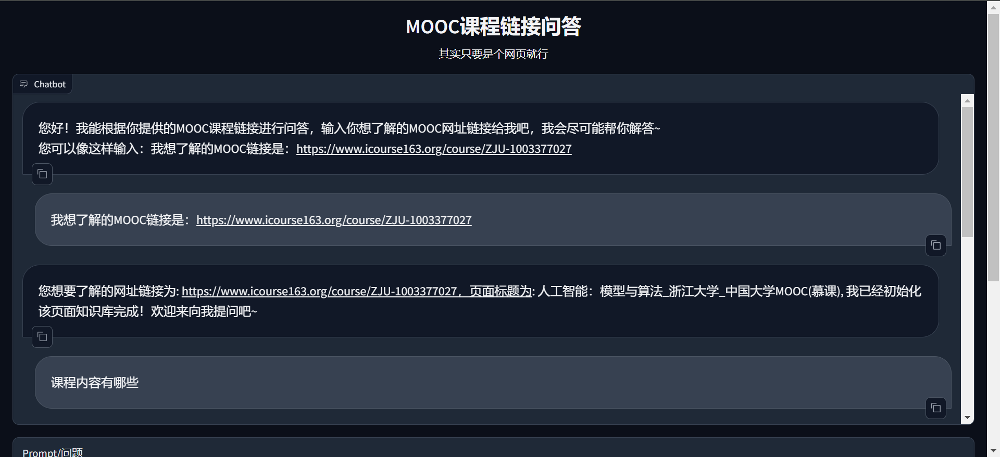

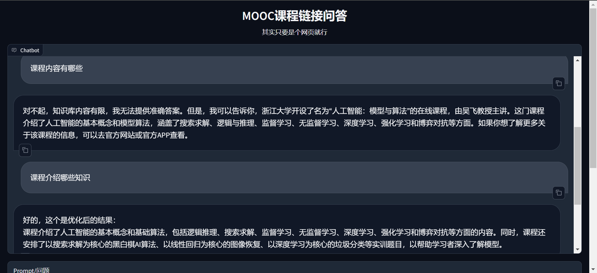

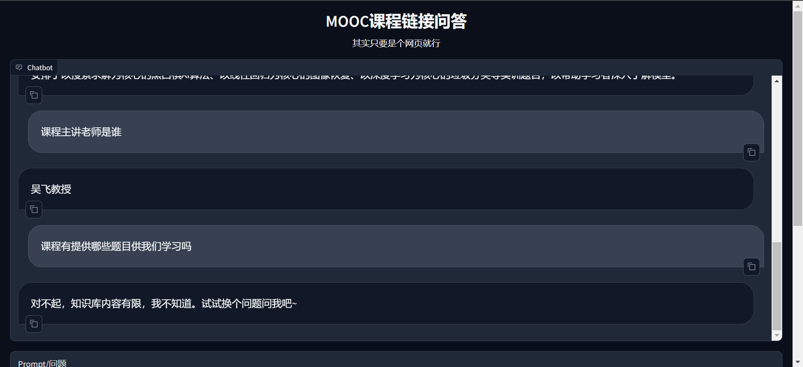

### 其他网页

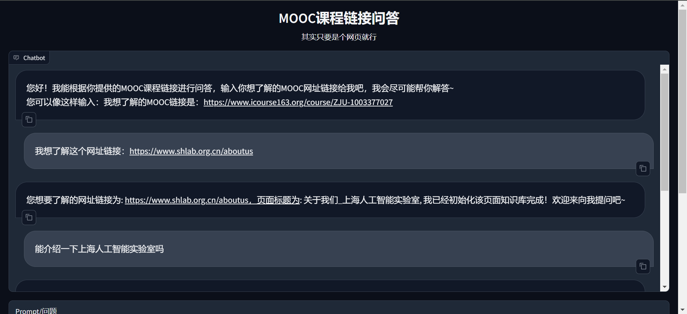

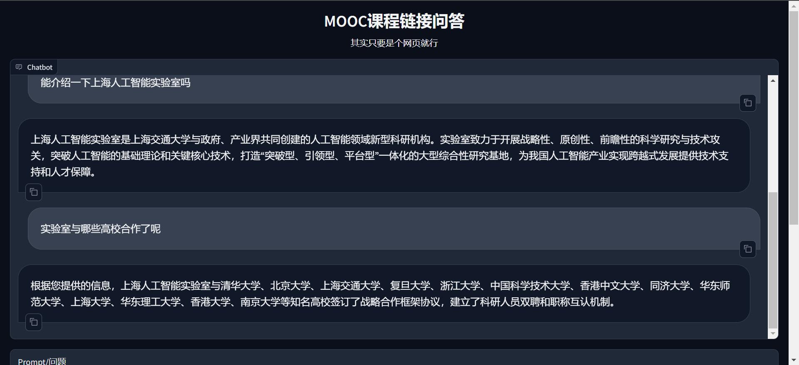

## 流程

其中网址链接的提取先由模型进行提取尝试，若模型提取不出则再通过正则实现。

## DEBUG

### MOOC 课程

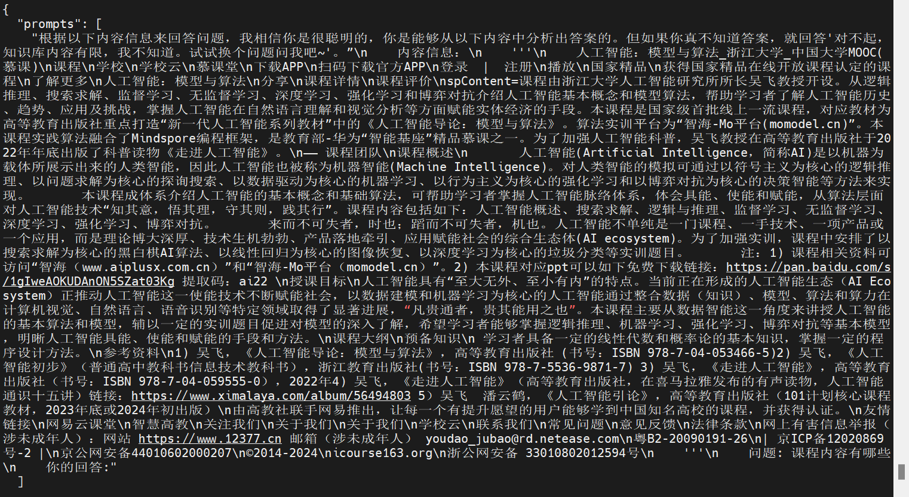

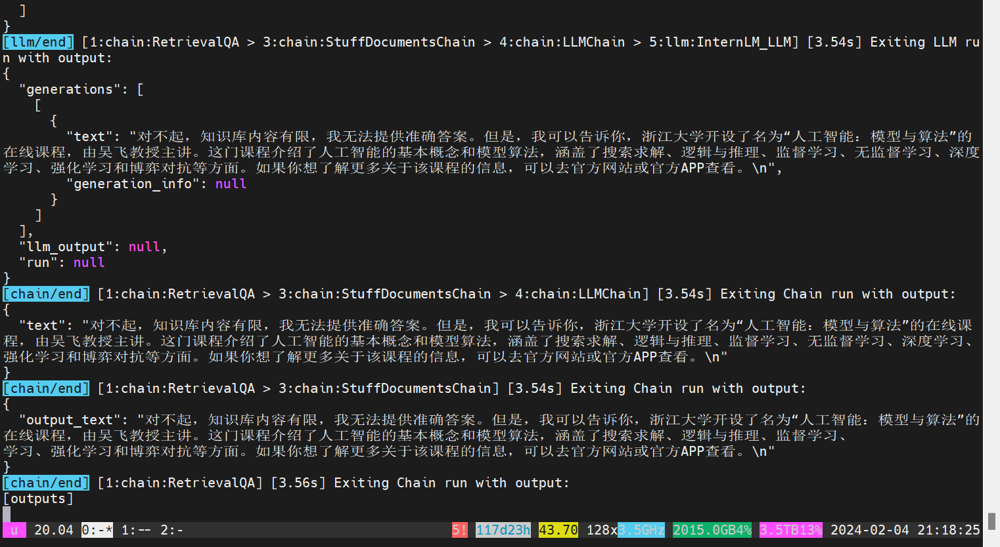

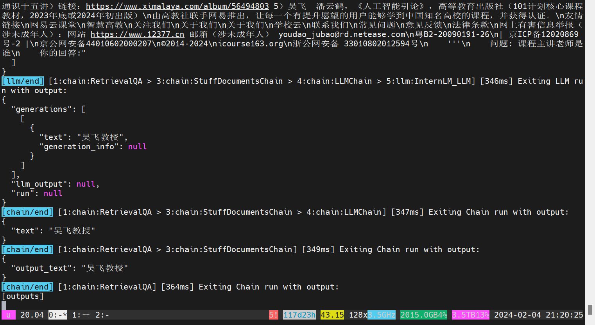

### 其他网页

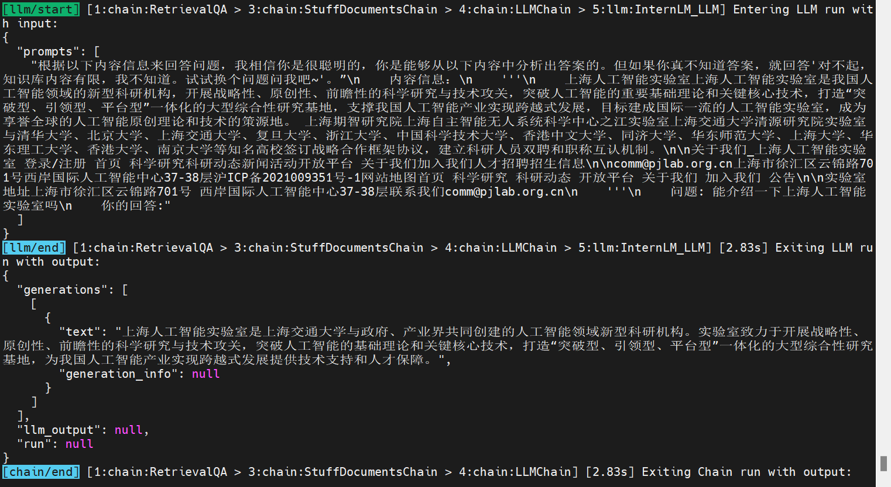

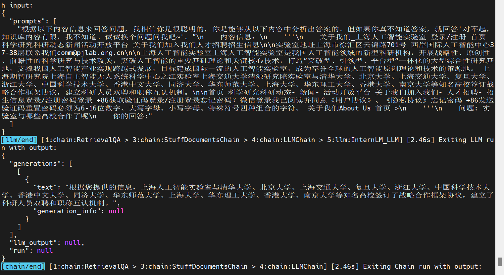

## 存在问题

> 时间原因没能解决

1. 网页内容加载实际不全
2. 检索效果很一般
3. 模型输出会出现乱码情况
4. 向量数据库的存储文本分块没调好

## 未来可能拓展

> 时间原因没能实现

1. 模型微调（输出内容更标准化）
2. 量化部署（对比量化前后显存占用、模型表现）
3. 结合 Lagent 新增搜索功能
4. 对页面内容搭建图数据库（实体识别、关系抽取）
5. 用户提问对图数据库进行检索（三元组）

## 其他

[PyCharm远程运行调试代码](https://zhuanlan.zhihu.com/p/38591832)

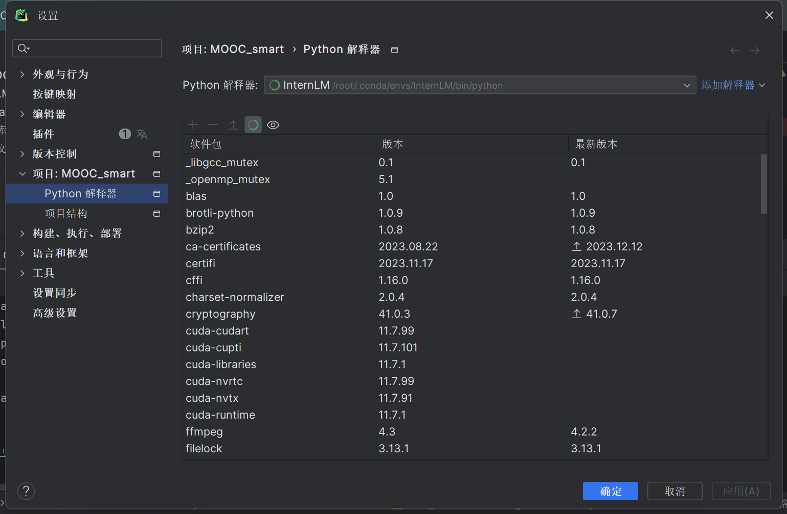